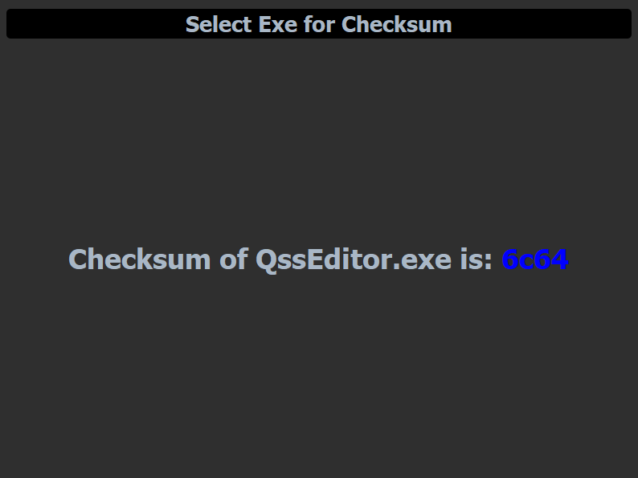

# CRC Checksum Calculator

A Qt-based application designed to calculate and verify the CRC checksum of `.exe` files. This tool is essential for developers and security enthusiasts who need a quick and reliable way to ensure the integrity of their application files.

## Features

- **CRC Checksum Calculation:** Quickly computes the CRC checksum of `.exe` files.
- **Clean Interface:** Displays results on a clean graphical user interface (GUI).
- **Qt-Based:** Built with the Qt framework for seamless cross-platform compatibility.
- **Setup File Included:** A setup file is provided for instant running of the application int the : [Crc Checksum Setup](./CrcCalculator_Setup)

## Screenshots



## Installation

### Prerequisites

- Qt 5.x or later
- C++ Compiler

### Build Instructions

1. Clone the repository:
   ```bash
   git clone https://github.com/yourusername/CRC-Checksum-Calculator.git
   ```
2. Navigate to the project directory:
   ```bash
   cd CRC-Checksum-Calculator
   ```
3. Open the project in Qt Creator or build it using the command line:
   ```bash
   qmake && make
   ```

### Usage

1. Run the executable generated after the build.
2. Use the file browser to select the .exe file you wish to check.
3. The application will calculate and display the CRC checksum of the file on the GUI.

### Contributing

Feel free to fork this project, submit pull requests, or open issues if you have any suggestions or encounter any bugs.

### License

This project is licensed under the MIT License.

### Contact

For any questions or feedback, please contact panditritesh2001@gmail.com
